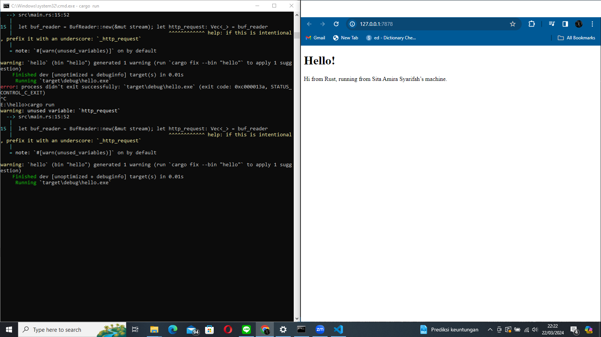

# modul-6-adpro

**Commit 1**

The Rust function `handle_connection` is tailored to manage TCP connections, focusing particularly on parsing and presenting HTTP request headers. It employs `TcpStream` to establish the connection and `BufReader` for streamlined reading. Within the function, it iterates through lines from the connection until it reaches the conclusion of the HTTP headers, then compiles and outputs these headers.

**Commit 2**

Modifying the `handle_connection` function to display a basic HTML page provided valuable insights into the process of delivering content to a web browser. Previously, the code merely examined the web request without taking significant action. However, the updated function now effectively delivers an actual web page that is visible in our browser. This experience enlightened me on the communication between a server and a browser, adhering to specific protocols such as responding with "OK" to confirm smooth operation and indicating the page size to help the browser anticipate data. Furthermore, it demonstrated the utilization of Rust to access a file and transmit its content over the internet.

**Commit 3**

Certainly, here's a breakdown of the process into step-by-step instructions:

1. **Add a New HTML File:**
   - Create a new HTML file named "notfound.html" to serve as the 404 Not Found page.

2. **Update the HTTP Server Function:**
   - Modify the handle_connection function within your HTTP server.

3. **Inspect Request Type:**
   - Within the handle_connection function, examine the initial line of the client's HTTP request.

4. **Check Request Type:**
   - Verify whether the request is a GET/HTTP/1.1 request, indicating a request for the root path (/).

5. **Handle Request Type:**
   - If the request is a GET/HTTP/1.1 request:
     - Respond with the status line HTTP/1.1 200 OK.
     - Serve the contents of the hello.html file.

6. **Handle Other Request Types:**
   - If the request is not a GET/HTTP/1.1 request:
     - Issue a HTTP/1.1 404 NOT FOUND status line.
     - Serve the contents of the notfound.html file.

**Commit 4**

I have updated the handle_connection function to manage various HTTP GET requests based on the request line.

When the request line reads "GET / HTTP/1.1" precisely, it signifies that the client is seeking the root directory of the server. In response, I set the HTTP status line to "HTTP/1.1 200 OK," denoting a successful request, and select "hello.html" as the file to be returned. This behavior is customary for serving a homepage or the primary entry point of a website.

If the request line corresponds to "GET /sleep HTTP/1.1," I interpret it as an instruction to simulate a delay before responding. I accomplish this by pausing execution for 10 seconds, utilizing Rust's thread::sleep(Duration::from_secs(10)). This functionality can be utilized to assess the client's handling of delayed server responses. Upon completion of the delay, the server proceeds to respond with "HTTP/1.1 200 OK" and serves the same "hello.html" file. This scenario illustrates the implementation of artificial delays for specific endpoints.

For any other request lines that deviate from the aforementioned patterns, the server defaults to responding with "HTTP/1.1 404 NOT FOUND" and serves a "notfound.html" file. This case is employed to address unknown or unhandled requests, informing the client that the requested resource could not be found on the server.

**Commit 5**

How the ThreadPool works :
- Initialization:
  - When the server starts, it establishes a ThreadPool containing a fixed number of worker threads.
  - These threads are initialized and ready to handle tasks immediately upon creation.

- Incoming Connections:
  - As clients connect to the server, the main thread accepts the TCP connections.
  - For each connection, the main thread assigns a task (the handle_connection function) to the ThreadPool.

- Task Execution:
  - Worker threads within the ThreadPool retrieve tasks from the queue.
  - Each worker thread processes its assigned task, which typically involves managing a TCP connection, handling the HTTP request, generating the response, and sending it back to the client.

- Concurrency:
  - Through the ThreadPool mechanism, the server can concurrently handle multiple connections, up to the predetermined number of threads in the pool.
  - This concurrency capability enhances the server's responsiveness and scalability compared to single-threaded or new-thread-per-request models.